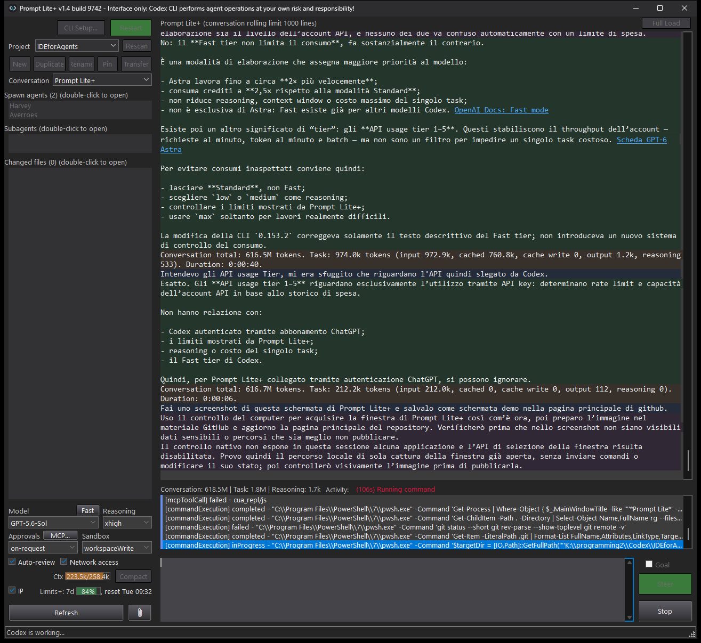

# TMI Lite+ for AI agents

**Lightweight interface for AI agents**

TMI Lite+ is an independent Windows x64 desktop interface for Codex CLI,
designed to keep AI-assisted development practical on computers with limited
performance. It provides project and conversation management, working-directory
selection, model and reasoning controls, approvals, tool activity, file access,
diff viewing, and token/usage information in a compact, low-overhead interface.

Each application instance runs its own Codex CLI app-server, allowing independent
conversations to be used side by side. The interface avoids animations and heavy
conversation rendering, while additional views such as full history, usage
charts, images and diffs are available when requested.

TMI Lite+ is the interface, not the AI engine: Codex CLI performs agent operations
and provides the connection to models and services. The application is
hobby-developed, free of charge, and independent of OpenAI. See the license and
notices below for terms of use and responsibilities.

Documentation version 1.6 — **stable release** (28 September 2026).
Windows executable version: **1.6.9767.30081** (Release/Win64).

Latest **Rolling**: **1.6.9767.41769** (Release/Win64). Adds automatic assignment
when a project returns no active conversations: once per application launch,
unassigned active threads are matched to unique project roots across all projects.
Results and errors appear in Activity; empty projects are not deleted.
Also includes the explicit
**Assign unassigned threads to projects...** command, including archived main
threads, with unique exact-root matching and a final report. Existing assignments,
agents, working directories and files are left unchanged.
[Download Rolling](https://github.com/SbiriJJ/tmi-lite-plus/releases/tag/rolling).

Formerly Prompt Lite+. This is the renamed 1.6 build; install it manually when
switching from the old application. Do not run old and new names concurrently:
they use separate instance-coordination namespaces.

Requires Codex CLI **0.157.1** or later. Version 1.6 is available through the
Release update channel. Rolling is a separate opt-in update channel.
See [release notes](RELEASE_NOTES.md).

## Screenshot

TMI Lite+ is not affiliated with, endorsed by, sponsored by, or supported by
OpenAI. Agent operations are performed by Codex CLI under the permissions
selected by the user. The user is responsible for reviewing and authorizing
those operations and their consequences.

TMI Lite+ is hobby-developed software provided free of charge and may be
used for any lawful personal or professional purpose. It is not designed,
certified, supported, or warranted for professional, production,
safety-critical, or business-continuity use. Any such use is at the user’s
discretion and risk.

It is designed as a lightweight interface for computers with limited
performance, particularly where the ChatGPT desktop app causes excessive
system load.

## What's new in 1.6

- Server-owned projects and a grouped Raize thread browser, with global title
  search, archived-only viewing and commands on the selected row's context menu.
- A separate modeless conversation-content search window with excerpts and paging.
- Thread, project and working directory are explicit and independent. Project
  assignment does not move files; directory changes use app-server settings.
- The browser opens at startup and expands the last-used project after its
  list is ready and visible, without opening a thread automatically.
  **Show Threads / Show Current** switches the left panel.
- Find has an integrated search/clear button: Enter searches, Esc clears.
  Editing or clearing restores the magnifier. Prompt shortcuts stay in the prompt editor.
- **Project roots** manages the project's directory list and assigns a selected
  root to the current thread. Roots in use cannot be removed. Assignment to a
  project supports creating a new project and preserves the thread directory.
- Windows date preferences are respected. Conversation caching can be disabled
  in Config; Full Load is retained.
- Runtime tool timing and an on-demand MCP/connector/background-terminal inventory.
- Account Usage charts, Unicode formulas and an on-demand local image viewer
  are included from the preceding Rolling work.

See [release notes](RELEASE_NOTES.md) for limitations and verification.

## Previous 1.5 highlights

- A gear-button **Config** dialog exposes rolling limits, three conversation
  color presets and **Release/Rolling** update schedules. Checks/downloads run
  in the background; installation still requires an explicit restart.
- Structured asynchronous agent questions are displayed in the conversation.
  **Questions (n)** opens a non-modal reply window with suggested answers and
  free text. Replies can reach an active task without interrupting it.
- Reply drafts remain available until the server accepts the submission.
  Questions and replies are associated with their original conversation.
- Model and reasoning selectors use thread metadata during opening, followed
  by the current server settings. List refreshes do not overwrite local choices.
- Codex CLI 0.153.4 schemas were checked; token accounting remains unchanged.

## Previous 1.4 highlights

- Prompt submission is more reliable, including fast `Ctrl+Enter`, prompt
  clearing, cursor placement, and separation of the first agent response from
  the submitted prompt.
- Conversation block backgrounds are recalculated after window resizing and
  the prompt area expands correctly when no Goal panel is visible.
- Full Load identifies the speaker beside each timestamp, and local file paths
  can be revealed reliably with **Show in Explorer**.
- Additional server rate-limit buckets are preserved under **Limits+** and
  exposed in the existing hint without expanding the interface.
- Pinned conversations remain visible in their normal project list while also
  being placed at the top for quick access.
- Large conversations use summarized cursor-paginated history and a local
  rolling-window cache. The cached view is shown immediately; if server
  metadata has changed, TMI Lite+ refreshes it in the background. Historical
  tool output and diffs are not downloaded by the normal reload. Full Load uses
  large message-only pages,
  reports progress, and can retain a partial transcript when stopped.
- Project conversations use a compact dropdown and open immediately when
  selected.
- Compatibility has been verified with Codex CLI 0.152.0; its sub-agent and
  spawn-agent protocol structures remain compatible with the current lists.

See [Release Notes](RELEASE_NOTES.md) for development status and release history.

## Download and installation

1. Open the [TMI Lite+ 1.6 release](https://github.com/SbiriJJ/tmi-lite-plus/releases/tag/v1.6-tmi) and download its Win64 ZIP.
2. Verify the archive against the published SHA-256 checksum.
3. Extract the complete archive into a writable directory.
4. Start `TMILitePlus.exe`.
5. Read and accept the displayed disclaimer.
6. Use **CLI Setup** to detect, install, or update Codex CLI.
7. Complete Codex CLI authentication when requested.

The archive includes a neutral `TMILitePlus.ini`. It contains no project
path, thread identifier, download directory, or accepted EULA identity. TMI
Lite+ updates it locally as the application is used.

Do not run TMI Lite+ directly from inside the ZIP archive.

## Requirements

- 64-bit Windows;
- Codex CLI 0.157.1 or later, installed and authenticated, or permission to
  install/update it through **CLI Setup**;
- an OpenAI account or subscription supported by Codex CLI.

Codex CLI, OpenAI accounts, models, subscriptions, and services are not
included with TMI Lite+.

## Documentation

- [End User License Agreement](EULA.md)
- [Legal and Copyright Notice](LEGAL_NOTICE.md)
- [Privacy Notice](PRIVACY.md)
- [Third-Party Notices](THIRD_PARTY_NOTICES.md)
- [User Guide](USER_GUIDE.md)
- [Release Notes](RELEASE_NOTES.md)

## Protocol compatibility

TMI Lite+ depends on the `app-server` protocol exposed by the installed Codex
CLI. A later Codex CLI release may require a corresponding TMI Lite+ update.

TMI Lite+ 1.6 requires Codex CLI 0.157.1 or later. The protocol was checked
against CLI 0.157.1. New asynchronous questions require a CLI/model that emits
them; absent metadata is confirmed through the normal thread resume response.

TMI Lite+ can be used on the same computer as the ChatGPT desktop app, but
do not use both applications on the same project at the same time.

Official Codex documentation:
[developers.openai.com/codex](https://developers.openai.com/codex/).
